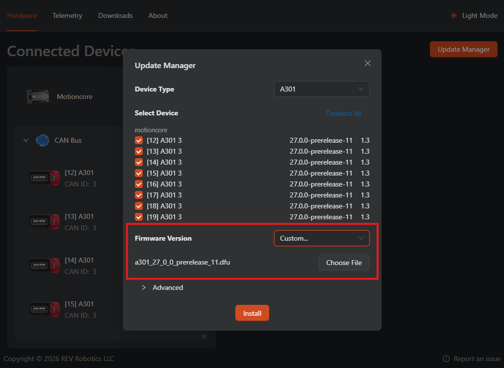

# A301

## Software Resources

### API

The A301 API is available through REVLib and will later be available natively through WPILib in the near future.

REVLib should be available in the vendor dependencies of WPILib VS Code, but you can also use this JSON URL directly:

```txt
https://software-metadata.revrobotics.com/REVLib-2027.json
```

[Offline Install](https://github.com/REVrobotics/REV-Software-Binaries/releases/download/revlib-2027.0.0-alpha-4/REVLib-offline-v2027.0.0-alpha-4.zip)

Refer to [WPILib Docs](https://docs.wpilib.org/en/stable/docs/software/vscode-overview/3rd-party-libraries.html) about installing 3rd party libraries, and see [REV.md](REV.md) for the full REVLib changelog.

> [!IMPORTANT]
> A301 firmware v27.0.0-prerelease.15 introduces a **breaking change** to the A301 CAN protocol. REVLib v2027.0.0-alpha-4 requires firmware v27.0.0-prerelease.15 or later, and firmware v27.0.0-prerelease.15 requires REVLib v2027.0.0-alpha-4 or later — you must update both together.

### Hardware Client 2

REV Hardware Client 2 (RHC2) is used to update and test the A301:

- [RHC2 for Desktop](https://alpha.rhc2.revrobotics.com/download-site/download.html)
- [RHC2 IPK for Systemcore](https://alpha.rhc2.revrobotics.com/download-site/debian/rev-robotics-rev-hardware-client-alpha_1.2.1_arm64.ipk) - Install this by clicking "Add Package" on the home screen of Systemcore and selecting this file. It will take a minute or so to start up.

See [REV.md](REV.md) for the full RHC2 changelog.

### Firmware

> [!IMPORTANT]
> A301s must be updated to 27.0.0-prerelease.11 or later before use. REVLib and RHC2 will prevent you from running an A301 with an older version.

> [!WARNING]
> A301 firmware v27.0.0-prerelease.15 is a **breaking change** to the A301 CAN protocol. You must update REVLib to v2027.0.0-alpha-4 or later to use it, and likewise REVLib v2027.0.0-alpha-4 will not work with older firmware — update both together.

> [!CAUTION]
> Update RHC2 to **1.2.1 before** updating the A301 to v27.0.0-prerelease.15. RHC2 1.2.1 handles the transition from the previous spec to the new one; older versions of RHC2 do not, and performing the update with an older RHC2 can leave the A301's firmware in a bad state.
>
> If this happens, it is recoverable, but not a good time: update RHC2 to 1.2.1, then **force a bootloader update** by enabling the checkbox in the "Advanced" section of the update manager and re-running the update.

The recommended method to update the A301 firmware is through REV Hardware Client 2 running directly on Systemcore. Since Systemcore will likely not be connected to internet, you will need to upload the firmware file to RHC2 using the dialog as shown below.



Direct firmware downloads for updating via Systemcore:

- [A301 v2027.0.0-prerelease.15](https://github.com/REVrobotics/REV-Software-Binaries/releases/download/a301-27.0.0-prerelease.15/a301_27_0_0_prerelease_15.dfu) - please review warnings above before updating

> [!NOTE]
> The firmware can also be updated from RHC2 on desktop, but a bridging device (SPARK Flex, PDH, etc) is **required** for this method. To get the latest version of A301 firmware in RHC2, enter the following code in the "Downloads" tab of RHC2: `a301-alpha`

<details>
<summary>A301 Firmware Changelog</summary>

#### 2027.0.0-prerelease.15

- New A301 protocol
- Fix for deceleration asymmetry in voltage mode
- Enabled configurable status periods
- Settings save automatically
- Faster eeprom saving
- Better rotor estimation during stall
- Added gearbox and motor life handlers
- Added user velocity limit during position control
- Added support for MRC override to run without a driver station

#### 2027.0.0-prerelease.14

- Fixes sensor faults not detected in voltage modes
- Fixes false failed gearbox detection

#### 2027.0.0-prerelease.12

- Fixes status periods
- Improves voltage control
- Replaces output current on status0 with improved average motor current
- Improves applied output reporting

#### 2027.0.0-prerelease.11

Initial release for A301

</details>

<details>
<summary>Older downloads (not compatible with REVLib 2027.0.0-alpha-4 or later)</summary>

- [A301 v2027.0.0-prerelease.14](https://github.com/REVrobotics/REV-Software-Binaries/releases/download/a301-27.0.0-prerelease.14/a301_27_0_0_prerelease_14.dfu)
- [A301 v2027.0.0-prerelease.12](https://github.com/REVrobotics/REV-Software-Binaries/releases/download/a301-27.0.0-prerelease.12/a301_27_0_0_prerelease_12.dfu)
- [A301 v2027.0.0-prerelease.11](https://github.com/REVrobotics/REV-Software-Binaries/releases/download/a301-27.0.0-prerelease.11/a301_27_0_0_prerelease_11.dfu)

</details>

## Getting Started

Full code docs for the A301 API can be found here: [Java](https://codedocs.revrobotics.com/java/com/revrobotics/spark/a301), [C++](https://codedocs.revrobotics.com/cpp/classfirst_1_1a301_1_1_a301.html)

You can create an A301 object by doing the following:

```java
// Create an A301 object on Motioncore channel 0. The A301's CAN ID will be autodetected.
A301 motor = new A301(CANBusMap.CAN_D0);

// Create an A301 object on Motioncore channel 0, with a specific CAN ID of 5.
A301 motor = new A301(CANBusMap.CAN_D0, 5);
```

> [!NOTE]
> It is recommended to use the CANBusMap rather than a raw integer as Motioncore D0 is not the same as '0' (which is on Systemcore). We will look into ways to remove this potential error as we iterate on the A301 API.

To drive the motor, there are individual methods for the different control types:

```java
// Command the motor to a velocity in RPM
motor.setVelocity(100);

// Command the motor to a relative position (multiple rotations)
motor.setPosition(5);

// Command the motor to an absolute position (single rotation)
motor.disableAbsolutePositionContinuousInput(); // Once called, this setting will be saved to the motor
motor.setAbsolutePosition(0.4);

// Command the motor to an absolute position with continuous input (shortest path)
motor.enableAbsolutePositionContinuousInput(); // Once called, this setting will be saved to the motor
motor.setAbsolutePosition(-0.4);

// Command the motor to a position with a speed constraint in RPM
motor.setPosition(5, 50);
motor.setAbsolutePosition(0.4, 50);

// Command the motor to a specific throttle level 
motor.setThrottle(0.5);
```

The A301 class offers getters to retrieve the status of the device. These will return a Signal object which includes the value and additional information about its validity:

```java
// Get the relative position of the encoder
SmartDashboard.putNumber("position", motor.getRelativeEncoderPosition().get());

// Get the input voltage of the motor
SmartDashboard.putNumber("voltage", motor.getBusVoltage().get());

// Check if the received value is valid before using it
Signal<Double> velocity = motor.getEncoderVelocity();
if (velocity.isValid()) {
    odometry.update(velocity.get());
}
```
